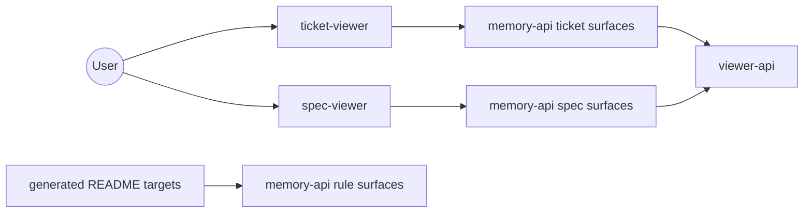

## Dependency Graph

```mermaid
flowchart LR
    User((User)) --> TicketViewer[ticket-viewer]
    User --> SpecViewer[spec-viewer]
    TicketViewer --> TicketTools[memory-api ticket surfaces]
    SpecViewer --> SpecTools[memory-api spec surfaces]
    TicketTools --> ViewerAPI[viewer-api]
    SpecTools --> ViewerAPI
    Docs[generated README targets] --> MemoryTools[memory-api rule surfaces]
```
