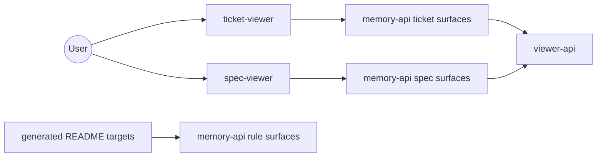

<!-- rule-api:file generated=true -->

<!-- rule-api:entry id=0b46b9a7-b821-428f-8025-aff2a2fe800a slug=memory-viewers/readme/memory-viewers/l1 -->
# memory-viewers

memory-viewers is the top-level repository for the user-facing viewer tools and the nested toolchain they depend on.

## Tool Surface

| Tool | What it exposes | Use it when |
| --- | --- | --- |
| <code>ticket&#8209;viewer</code> | Ticket board and graph views | You want to review active work, owners, and dependency flow visually. |
| <code>spec&#8209;viewer</code> | Spec browsing UI | You want to inspect specs, sections, and linked code references. |
| <code>memory&#8209;api</code> | CLI, MCP, HTTP, and VS Code tooling | You need automation or authoring workflows behind rules, specs, tickets, and audits. |
| <code>viewer&#8209;api</code> | Shared viewer-facing APIs | You need reusable viewer integration surfaces across the stack. |

<!-- rule-api:entry id=2b5a6704-cdc0-4897-8d83-8a8b2707ee1a slug=memory-viewers/readme/memory-viewers/user-stories/l5 -->
## Tool Screenshots

`ticket-viewer` can keep the queue visible while a selected ticket stays open in the detail pane.


`spec-viewer` can open a specific spec and expose its API, code references, and health tabs in place.


<!-- rule-api:entry id=f116a30d-199c-45db-a22c-6049d319f263 slug=memory-viewers/readme/memory-viewers/usage-guide/l11 -->
## Dependency Graph



<!-- rule-api:entry id=5e37e92f-6f55-49c0-b726-4a6c89dd940f slug=memory-viewers/readme/memory-viewers/nested-workspaces/l18 -->
## Tool Use Examples

```bash
viewer-ctl start ticket-viewer
viewer-ctl start spec-viewer
cargo run -p rule-cli -- sync-targets --config memory-viewers/rule-targets.yaml
```

- Start `ticket-viewer` to inspect work in progress and board relationships.
- Start `spec-viewer` to browse spec structure and linked code references.
- Regenerate the parent README when rule content changes.
