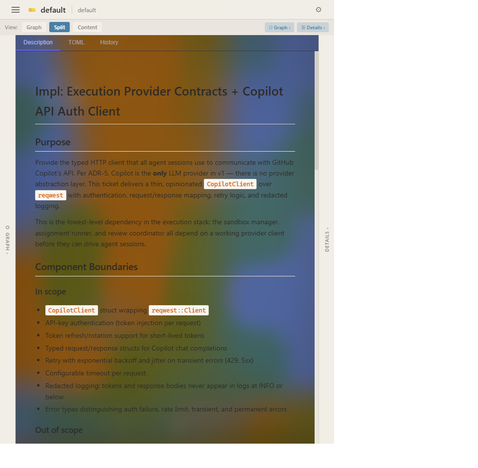
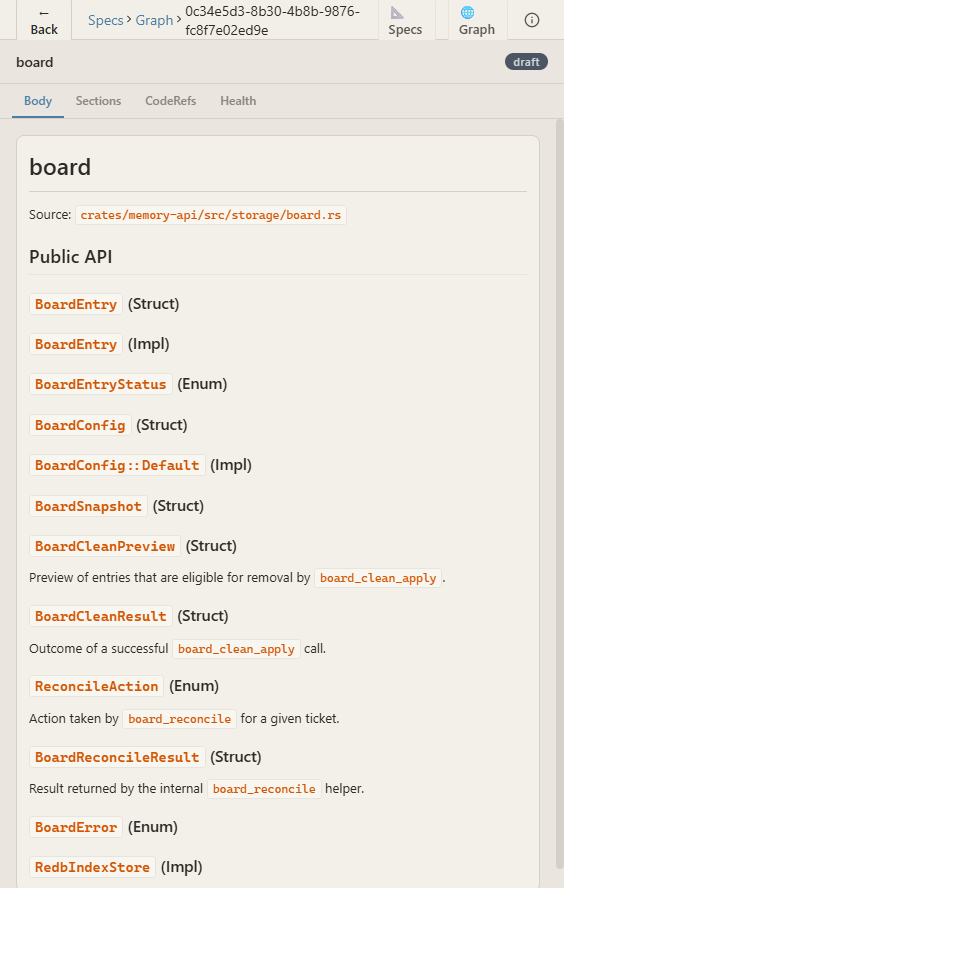
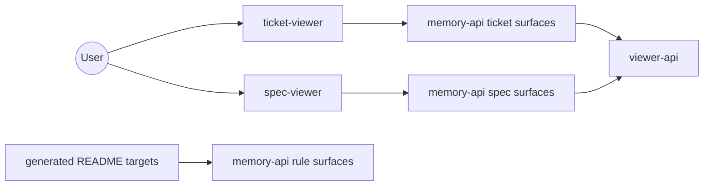

<!-- rule-api:file generated=true -->

<!-- rule-api:entry id=0b46b9a7-b821-428f-8025-aff2a2fe800a slug=memory-viewers/readme/memory-viewers/l1 -->
# memory-viewers

memory-viewers is the top-level repository for the user-facing viewer tools and the nested toolchain they depend on.

Direct child READMEs:

- [memory-api/README.md](memory-api/README.md) for the rule, spec, ticket, and audit automation surfaces.
- [viewer-api/README.md](viewer-api/README.md) for `viewer-ctl`, the shared viewer runtime, and the frontend scaffold.

Installable content in or directly behind this repository includes the `spec-viewer` and `ticket-viewer` binaries plus the `viewer-ctl`, `rule`, `spec`, `ticket`, and `audit` command surfaces documented in those child READMEs.

## Tool Surface

| Tool | What it exposes | Direct docs |
| --- | --- | --- |
| <code>ticket&#8209;viewer</code> | Ticket board and graph views | [memory-api/README.md](memory-api/README.md) for the ticket backends and [viewer-api/README.md](viewer-api/README.md) for the shared viewer runtime. |
| <code>spec&#8209;viewer</code> | Spec browsing UI | [memory-api/README.md](memory-api/README.md) for the spec backends and [viewer-api/README.md](viewer-api/README.md) for the shared viewer runtime. |
| [<code>memory&#8209;api</code>](memory-api/README.md) | CLI, MCP, HTTP, and VS Code tooling | [memory-api/README.md](memory-api/README.md) |
| [<code>viewer&#8209;api</code>](viewer-api/README.md) | Shared viewer-facing APIs | [viewer-api/README.md](viewer-api/README.md) |

<!-- rule-api:entry id=2b5a6704-cdc0-4897-8d83-8a8b2707ee1a slug=memory-viewers/readme/memory-viewers/user-stories/l5 -->
## Tool Screenshots

`ticket-viewer` can keep the queue visible while a selected ticket stays open in the detail pane.



`spec-viewer` can open a specific spec and expose its API, code references, and health tabs in place.



<!-- rule-api:entry id=f116a30d-199c-45db-a22c-6049d319f263 slug=memory-viewers/readme/memory-viewers/usage-guide/l11 -->
## Dependency Graph



<!-- rule-api:entry id=5e37e92f-6f55-49c0-b726-4a6c89dd940f slug=memory-viewers/readme/memory-viewers/nested-workspaces/l18 -->
## Tool Use Examples

### Install the shared tools first

From the parent `context-engine` checkout, install the viewer lifecycle tooling and authoring CLIs in one step:

```bash
bash ./install-tools.sh
```

That installs `viewer-ctl`, `trunk`, `spec-viewer`, `ticket-viewer`, and the `rule`, `spec`, `ticket`, and `audit` CLIs onto Cargo's bin path. If you are working from a standalone `memory-viewers` checkout, follow the direct install commands in [memory-api/README.md](memory-api/README.md) and [viewer-api/README.md](viewer-api/README.md).

### Start the viewers and regenerate docs

```bash
viewer-ctl start ticket-viewer
viewer-ctl start spec-viewer
rule sync-targets --config memory-viewers/rule-targets.yaml
```

- `viewer-ctl start ...` follows the lifecycle workflow documented in [viewer-api/viewer-ctl/README.md](viewer-api/viewer-ctl/README.md).
- `rule sync-targets --config memory-viewers/rule-targets.yaml` is documented in [memory-api/tools/cli/rule-cli/README.md](memory-api/tools/cli/rule-cli/README.md).
- Continue from [memory-api/README.md](memory-api/README.md) for rule, spec, ticket, and audit command surfaces and from [viewer-api/README.md](viewer-api/README.md) for shared viewer runtime details.
